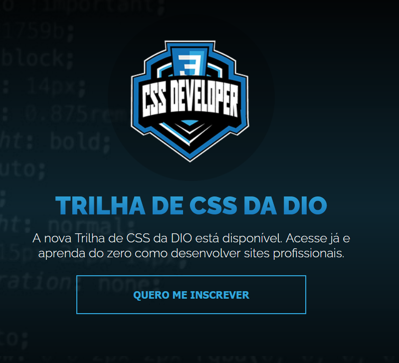
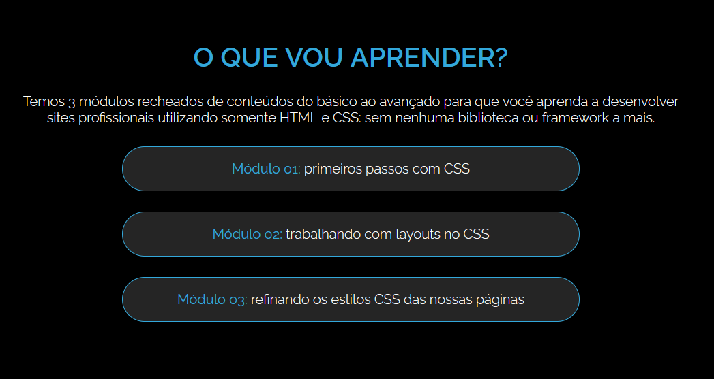

## 🎨 CSS Developer

O **CSS Developer** é uma landing page desenvolvida com HTML e CSS puros, desenvolvido no **bootcamp Santander 2025, em parceria com a DIO**. O foco do projeto é apresentar a Trilha de CSS da DIO de forma clara, organizada e responsiva, destacando os módulos de aprendizado e convocando o usuário com um call-to-action atraente.

 

## 🚀 Sobre o Projeto

Este projeto foi desenvolvido como parte do desafio prático do bootcamp:

* "Santander 2025 - Front-End"

O objetivo era construir uma página simples e funcional, válida, sem frameworks, usando apenas **HTML semântico e estilos CSS** e com base no projeto do **Figma**, para promover a trilha de CSS da DIO e convidar os usuários a se inscreverem.

## 📚 Objetivos do Desafio

* Estruturar o layout com **tags semânticas do HTML5**;
* Aplicar **CSS moderno** nos estilos: tipografia, cores, espaçamentos e responsividade;
* Desenvolver uma **interface atrativa e acessível** com boa organização visual.

## 🛠️ Tecnologias Utilizadas

## 🖼️ Visualização do Projeto

Uma prévia das principais funcionalidades do **CSS Developer**:

**🌐 Acesse o Projeto Online**

O projeto está disponível para visualização na **Vercel**. Clique no link abaixo para acessar:

**🌟 Tela Inicial**

Página com destaque para o logo CSS Developer e uma chamada principal para se inscrever no curso sobre CSS.

**📖 Sobre o curso**

Seção com apresentação dos módulos do curso da DIO.

